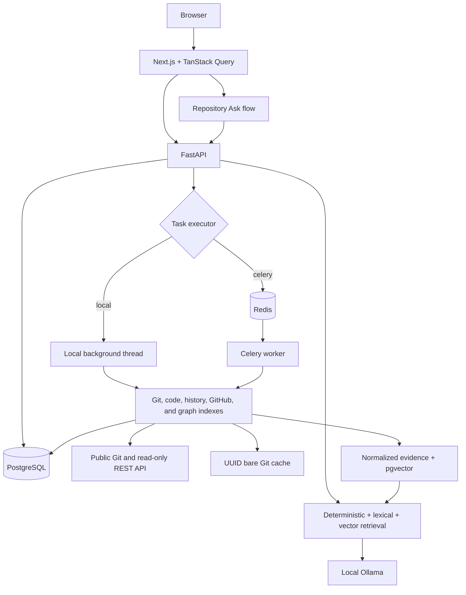

# CodeChronicle

Phase 8 adds deterministic historical architecture snapshots, commit/tag comparisons, cycle and
dependency evolution, structural drift baselines, and explicit policy-rule violations. See
[Architecture evolution](docs/architecture-evolution.md).

CodeChronicle is a local explorer for public GitHub repositories. It indexes default-branch Git
history, the current HEAD source snapshot, deterministic symbol history, public GitHub
development context, and a dependency graph. Its optional local Ollama assistant answers software
archaeology questions from cited repository evidence. It connects commits and symbols to pull
requests, issues, discussions, architecture, and potential change impact through a Next.js
interface and typed FastAPI API.

**CodeChronicle never executes code from analyzed repositories.** It does not install their
dependencies, import their modules, invoke their build tools, or run their scripts and tests.

## Implemented scope

- Canonical public `github.com/owner/repository` ingestion with bare clone/fetch storage.
- Default-branch commits, parents, changed files, renames, tags, bounded on-demand diffs, and
  refresh/rewrite reconciliation.
- Current HEAD tracked-file discovery using `git ls-tree` and source reads using `git cat-file`.
- Tree-sitter parsing for Python, JavaScript, TypeScript, TSX, Java, C, C++, Go, and PHP.
- Normalized functions, classes, methods, constructors, interfaces, enums, structs, traits,
  modules, source ranges, signatures, nesting, documentation where available, and imports.
- File tree, lazy source viewer with line numbers, symbol outline, and PostgreSQL symbol search.
- Incremental code indexing by Git blob SHA, including changed, deleted, and same-blob renamed
  files.
- Historical file and symbol lineages with introductions, body/signature/documentation changes,
  renames, moves, deletions, and conservative reintroductions.
- Repository and symbol timelines, historical source, bounded version comparisons, commit-level
  symbol changes, Git blame, previous-name search, and historical file viewing.
- Incremental historical refresh, rewrite/stale detection, explicit history limits, and stable
  lineage UUIDs.
- Read-only GitHub metadata synchronization for pull requests, genuine issues, labels,
  conversation comments, review comments, milestones, and lightweight public identities.
- Provenance-preserving commit-to-PR and PR-to-issue links, including affected-symbol context,
  cross-repository reference metadata, incremental upserts, and explicit rate-limit state.
- Deterministic repository, module, file, symbol, and external-package dependency nodes with
  evidence-bearing import, call, inheritance, containment, aggregate, and co-change edges.
- Bounded architecture, node detail, dependency path, cycle, hotspot, coupling, and potential
  impact APIs plus an interactive React Flow explorer.
- Immutable-Git architecture snapshots, release comparisons, dependency/cycle events, coupling
  trends, structural drift baselines, explicit dependency rules, and violation intervals.
- Local Ollama health/model checks, normalized evidence chunking, incremental content-hash
  embeddings in pgvector, model/dimension safety, and hybrid deterministic/lexical/vector retrieval.
- Repository-scoped Ask UI with contextual actions from code, symbol, commit, PR, issue, and
  architecture views, structured grounded answers, validated citations, evidence sufficiency,
  confidence labels, follow-up context, and safe low-evidence behavior.
- `TASK_EXECUTION_MODE=local` for native Windows development without Redis/Celery, plus the
  existing Docker/Celery execution path.

This repository implements through Phase 8 and stops before Phase 9. It does not use cloud LLMs,
analyze private repositories, modify analyzed code, create commits or pull requests, infer
runtime architecture, or attribute regressions.

## Architecture



The backend uses SQLAlchemy 2, psycopg, Alembic, Pydantic settings, structured logging, and
Tree-sitter. Tests use pytest and a real PostgreSQL schema; the frontend uses TypeScript,
React, Tailwind, Vitest, Testing Library, ESLint, and Prettier.

## Run with Docker

Install Docker Desktop and stop other processes on ports 3000 and 8000. From the project root:

```powershell
cd "D:\swe project"
if (!(Test-Path .env)) { Copy-Item .env.example .env }
docker compose config --quiet
docker compose up --build
```

Compose explicitly uses Celery mode and applies migrations before the API starts. Open:

- [CodeChronicle](http://localhost:3000)
- [API documentation](http://localhost:8000/docs)
- [Liveness](http://localhost:8000/api/health)
- [Dependency status](http://localhost:8000/api/system/status)

`docker compose down` stops the services without deleting their data volumes.

## Native Windows development in VS Code

Python 3.12+, Node.js 20.9+, Git, and PostgreSQL are required. Docker Desktop can provide only
PostgreSQL; Redis and Celery are not required. Open two VS Code terminals and run:

Backend terminal:

```cmd
cd /d "D:\swe project\backend"
npm run dev
```

Frontend terminal:

```cmd
cd /d "D:\swe project\frontend"
npm run dev
```

The backend command creates `.env` and `.venv` when missing, installs locked Python dependencies
when needed, starts the Compose PostgreSQL service when port 5432 is unavailable, applies
migrations, and launches Uvicorn in `TASK_EXECUTION_MODE=local`. The frontend command stops an
existing Compose frontend when necessary and launches Next.js on port 3000. Both commands detect
unrelated processes already occupying their ports and report an actionable error.

Ollama is optional. To enable Ask, install Ollama, choose and pull one chat model and one embedding
model, then set `OLLAMA_LLM_MODEL` and `OLLAMA_EMBEDDING_MODEL` in the root `.env`. See
[Local Ollama setup](docs/ollama.md) and [RAG architecture](docs/rag.md). All Phase 1–5 pages work
when Ollama is stopped.

To test Celery natively, set `TASK_EXECUTION_MODE=celery`, start Redis, then run this additional
backend terminal. The solo pool is a Windows development convenience:

```cmd
cd /d "D:\swe project\backend"
.venv\Scripts\python.exe -m celery -A app.workers.celery_app:celery_app worker --loglevel=info --pool=solo
```

## Configuration limits

| Setting | Default | Purpose |
| --- | ---: | --- |
| `MAX_REPOSITORY_SIZE_MB` | 500 | Bare Git cache limit |
| `MAX_COMMITS` | 10000 | Default-branch history limit |
| `MAX_REPOSITORY_FILES` | 50000 | Current tracked-file limit |
| `MAX_SOURCE_FILE_SIZE_BYTES` | 1000000 | Source parsing/content limit |
| `MAX_PARSE_TIME_PER_FILE_SECONDS` | 2 | Tree-sitter per-file time limit |
| `MAX_DIFF_SIZE_BYTES` | 500000 | On-demand diff response limit |
| `MAX_HISTORY_COMMITS` | 2000 | Historical commits parsed per repository |
| `MAX_HISTORICAL_FILES` | 20000 | Changed historical files parsed per run |
| `MAX_HISTORICAL_SYMBOL_SOURCE_BYTES` | 100000 | Stored/fetched symbol source limit |
| `MAX_HISTORY_INDEX_TIME_SECONDS` | 900 | Historical indexing time budget |
| `MAX_BLAME_LINES` | 500 | Maximum lines returned by one blame request |
| `SYMBOL_MATCH_THRESHOLD` | 0.86 | General lineage match threshold |
| `SYMBOL_RENAME_MATCH_THRESHOLD` | 0.9 | Rename/move match threshold |
| `GITHUB_TOKEN` | empty | Optional server-only token for higher public API limits |
| `MAX_GITHUB_PULL_REQUESTS` | 500 | Pull requests stored per repository |
| `MAX_GITHUB_ISSUES` | 1000 | Genuine issues stored per repository |
| `MAX_GITHUB_COMMENTS` | 5000 | Issue and PR conversation comments per sync |
| `MAX_GITHUB_REVIEW_COMMENTS` | 5000 | Code review comments per sync |
| `MAX_GITHUB_BODY_LENGTH` | 200000 | Stored bytes for each external text body |
| `GITHUB_REQUEST_TIMEOUT_SECONDS` | 15 | Timeout for each GitHub request |
| `GITHUB_MAX_RETRIES` | 3 | Temporary-failure retry limit |
| `MAX_GRAPH_NODES` | 50000 | Persisted dependency-node limit |
| `MAX_GRAPH_EDGES` | 200000 | Persisted dependency-edge limit |
| `MAX_GRAPH_RESPONSE_NODES` | 500 | Nodes returned in one graph view |
| `MAX_GRAPH_DEPTH` | 5 | Maximum subgraph, path, and impact traversal depth |
| `MAX_CALL_RESOLUTION_CANDIDATES` | 20 | Ambiguity guard for symbol resolution |
| `MAX_FILES_PER_COMMIT_FOR_COUPLING` | 100 | Excludes noisy commits from coupling |
| `MAX_GRAPH_BUILD_TIME_SECONDS` | 900 | Dependency graph indexing time budget |
| `ARCHITECTURE_SNAPSHOT_STRATEGY` | `adaptive` | Snapshot selection policy |
| `ARCHITECTURE_SNAPSHOT_INTERVAL_COMMITS` | 25 | Interval strategy spacing |
| `MAX_ARCHITECTURE_SNAPSHOTS` | 500 | Persisted historical snapshot cap |
| `MAX_HISTORICAL_GRAPH_NODES` | 5000 | Node cap for one historical snapshot |
| `MAX_HISTORICAL_GRAPH_EDGES` | 20000 | Edge cap for one historical snapshot |
| `MAX_ARCHITECTURE_HISTORY_COMMITS` | 2000 | Git-history scan cap |
| `MAX_ARCHITECTURE_HISTORY_BUILD_SECONDS` | 900 | Architecture indexing time budget |
| `ARCHITECTURE_RULE_MIN_EDGE_CONFIDENCE` | 0.8 | Minimum confidence for layer rules |
| `LLM_PROVIDER` | `ollama` | Local AI provider; cloud providers are unsupported |
| `OLLAMA_BASE_URL` | local Ollama URL | Credential-free local Ollama origin |
| `OLLAMA_LLM_MODEL` | empty | Explicit chat model name |
| `OLLAMA_EMBEDDING_MODEL` | empty | Explicit embedding model name |
| `OLLAMA_REQUEST_TIMEOUT_SECONDS` | 180 | Embedding and generation timeout |
| `AI_EMBEDDING_BATCH_SIZE` | 16 | Evidence documents per embedding request |
| `RAG_TOP_K_VECTOR` | 12 | Semantic candidates before retrieval fusion |
| `RAG_TOP_K_LEXICAL` | 12 | Lexical candidates before retrieval fusion |
| `RAG_TOP_K_FINAL` | 12 | Default fused evidence result count |
| `RAG_MAX_CONTEXT_CHARS` | 4000 | Maximum serialized RAG evidence context |
| `RAG_MAX_EVIDENCE_ITEMS` | 6 | Maximum evidence records sent to the LLM |
| `RAG_MAX_DIFF_CHARS` | 8000 | Maximum characters from one diff evidence item |
| `MAX_EMBEDDING_CHUNK_CHARS` | 5000 | Evidence chunk size limit |
| `MAX_DIFF_EMBEDDING_CHUNKS_PER_COMMIT` | 20 | Diff chunk cap per commit |
| `AI_MAX_ANSWER_CHARS` | 12000 | Maximum grounded answer length |

`GITHUB_TOKEN` is optional, used only by the backend, and never returned to the browser, logs, API
responses, or database. Empty-token mode uses GitHub's unauthenticated public API limits.

Excluded directory segments include `.git`, `node_modules`, `vendor`, `dist`, `build`, `.next`,
`coverage`, `target`, `bin`, `obj`, `__pycache__`, `.venv`, and `venv`. Binary/media/archive/
compiled files remain represented when useful but are never parsed or returned as source.

## API surface

| Method | Route | Purpose |
| --- | --- | --- |
| POST | `/api/repositories` | Validate a public URL and start/reuse analysis |
| GET | `/api/repositories/{id}` | Repository state and active job ID |
| POST | `/api/repositories/{id}/refresh` | Fetch and reconcile Git plus current code |
| GET | `/api/jobs/{id}` | Persistent job progress and safe errors |
| GET | `/api/repositories/{id}/commits` | Paginated commits |
| GET | `/api/repositories/{id}/commits/{sha}` | Commit details and file changes |
| GET | `/api/repositories/{id}/commits/{sha}/diff` | Bounded on-demand diff |
| GET | `/api/repositories/{id}/stats` | Git-history statistics |
| GET | `/api/repositories/{id}/tags` | Tag metadata |
| GET | `/api/repositories/{id}/code/stats` | Current-code statistics and languages |
| GET | `/api/repositories/{id}/files` | Hierarchical metadata-only file tree |
| GET | `/api/repositories/{id}/files/{path}` | Indexed file metadata |
| GET | `/api/repositories/{id}/files/{path}/content` | Bounded text content and line ranges |
| GET | `/api/repositories/{id}/files/{path}/symbols` | File outline in source order |
| GET | `/api/repositories/{id}/symbols` | Filtered, paginated symbol search |
| GET | `/api/repositories/{id}/symbols/{symbol_id}` | Symbol context and children |
| GET | `/api/repositories/{id}/imports` | Filtered, paginated imports |
| POST | `/api/repositories/{id}/code/reindex` | Reindex the current snapshot only |
| POST | `/api/repositories/{id}/history/reindex` | Start or continue historical indexing |
| GET | `/api/repositories/{id}/history/status` | Historical job state, limits, and counts |
| GET | `/api/repositories/{id}/history/events` | Filtered, paginated symbol-event timeline |
| GET | `/api/repositories/{id}/history/lineages` | Search current and previous symbol names |
| GET | `/api/repositories/{id}/symbols/{symbol_id}/history` | Resolve a current symbol to its lineage |
| GET | `/api/repositories/{id}/lineages/{lineage_id}` | Symbol history and confidence metadata |
| GET | `/api/repositories/{id}/lineages/{lineage_id}/versions` | Paginated historical versions |
| GET | `/api/repositories/{id}/lineages/{lineage_id}/events` | Chronological lineage events |
| GET | `/api/repositories/{id}/lineages/{lineage_id}/compare` | Bounded version diff |
| GET | `/api/repositories/{id}/lineages/{lineage_id}/at/{sha}` | Symbol state at a commit |
| GET | `/api/repositories/{id}/files/history?path=...` | File lineage and versions |
| GET | `/api/repositories/{id}/files/content-at?path=...&commit_sha=...` | Historical text |
| GET | `/api/repositories/{id}/commits/{sha}/symbols` | Symbols affected by a commit |
| GET | `/api/repositories/{id}/blame?path=...` | Bounded HEAD blame lines |
| POST | `/api/repositories/{id}/github/sync` | Start asynchronous public GitHub synchronization |
| GET | `/api/repositories/{id}/github/status` | Sync progress, limits, rate limit, and safe errors |
| GET | `/api/repositories/{id}/pull-requests` | Filtered, paginated pull requests |
| GET | `/api/repositories/{id}/pull-requests/{number}` | PR discussion, commits, issues, and symbols |
| GET | `/api/repositories/{id}/issues` | Filtered, paginated genuine issues |
| GET | `/api/repositories/{id}/issues/{number}` | Issue discussion and related code evidence |
| GET | `/api/repositories/{id}/commits/{sha}/context` | PR, issue, and symbol evidence for a commit |
| GET | `/api/repositories/{id}/lineages/{lineage_id}/context` | GitHub evidence for symbol events |
| POST | `/api/repositories/{id}/graph/reindex` | Build the current-HEAD dependency graph |
| GET | `/api/repositories/{id}/graph/status` | Graph progress, freshness, limits, and counts |
| GET | `/api/repositories/{id}/graph` | Bounded module, file, or symbol graph |
| GET | `/api/repositories/{id}/graph/subgraph` | Bounded neighborhood around a node |
| GET | `/api/repositories/{id}/graph/nodes/{node_id}` | Node metrics and relationships |
| GET | `/api/repositories/{id}/graph/metrics` | Fan-in, fan-out, centrality, and hotspots |
| GET | `/api/repositories/{id}/graph/cycles` | File or module dependency cycles |
| GET | `/api/repositories/{id}/graph/coupling` | Git-history change coupling |
| GET | `/api/repositories/{id}/graph/path` | Bounded directed dependency path |
| GET | `/api/repositories/{id}/architecture` | Components, layers, and dependencies |
| GET | `/api/repositories/{id}/impact` | Potential dependent impact for a file or symbol |
| GET | `/api/system/ai-status` | Safe Ollama and configured-model availability |
| GET | `/api/repositories/{id}/ai/status` | AI index progress, freshness, model, and dimension |
| POST | `/api/repositories/{id}/ai/reindex` | Build or incrementally rebuild evidence embeddings |
| POST | `/api/repositories/{id}/ask` | Grounded repository question with structured citations |
| GET | `/api/repositories/{id}/ai/search` | Debug hybrid evidence search without vector disclosure |

## Verification

Run linting, formatting, type checks, unit tests, and the production frontend build from
PowerShell:

```powershell
cd "D:\swe project"
.\scripts\check.ps1
```

To include the PostgreSQL integration suite, set `TEST_DATABASE_URL` to a migrated PostgreSQL
database and run `.\scripts\check.ps1 -Integration`.

Individual commands:

```text
backend:  python -m pytest
          python -m ruff check . ../scripts
          python -m ruff format --check . ../scripts
          python -m mypy app
frontend: npm run lint
          npm run format:check
          npm run typecheck
          npm test
          npm run build
```

Integration tests create a random PostgreSQL schema, apply all Alembic migrations, exercise the
real Git fixture, and remove the schema afterward. Set a dedicated `TEST_DATABASE_URL`; there is
no SQLite fallback. See [verification results](docs/verification.md).

## Documentation

- [Architecture](docs/architecture.md)
- [Git analysis](docs/git-analysis.md)
- [Static analysis](docs/static-analysis.md)
- [Historical analysis](docs/historical-analysis.md)
- [GitHub context](docs/github-context.md)
- [Dependency graph](docs/dependency-graph.md)
- [Security](docs/security.md)
- [Roadmap](docs/roadmap.md)
