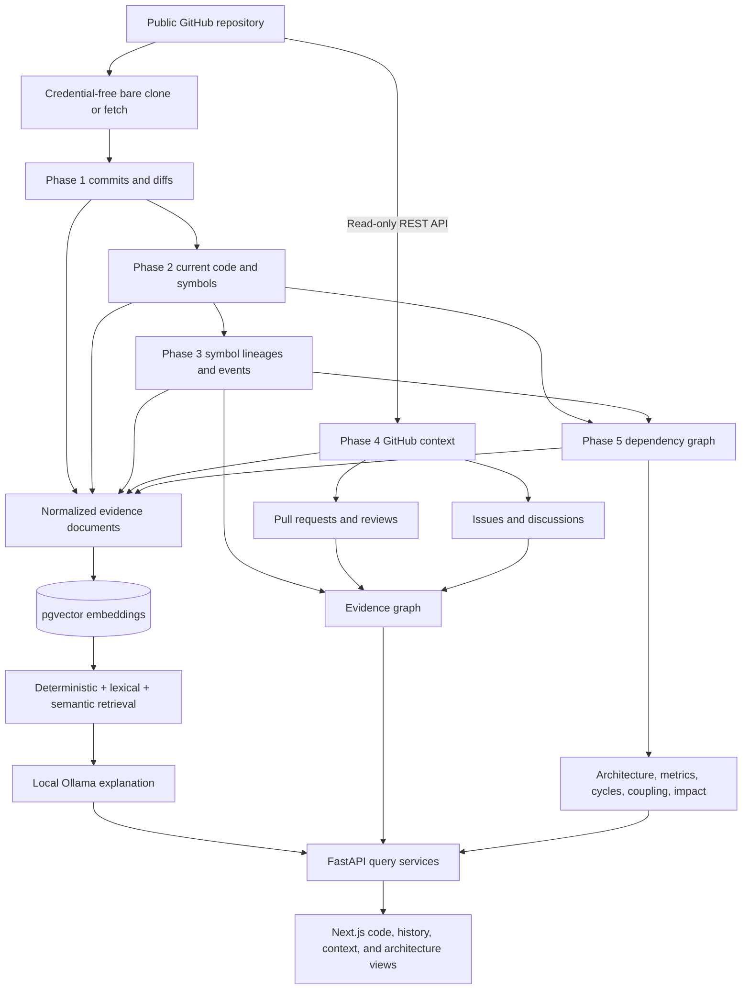

# Architecture after Phase 8

## Phase 7 archaeology

`ArchaeologyIndexService` reads existing Git, file-lineage, symbol-lineage, GitHub-context,
and dependency-graph records and writes bounded derived metrics and relationships. Route handlers
delegate to `ArchaeologyService`; they do not perform historical analysis. The deterministic
dossier works independently of Ollama, while optional explanations send only structured dossier
facts to the local model and reject summaries without evidence labels.

The additive tables are `archaeology_metrics`, `symbol_rewrite_events`,
`copy_move_candidates`, `contributor_entity_metrics`, and `archaeology_sync_states`. They
reference existing commits and symbol versions instead of duplicating history.

CodeChronicle separates HTTP transport, task dispatch, Git access, parsing, matching,
persistence, GitHub enrichment, graph analysis, and UI queries. Local background threads and
Celery workers call the same indexing services. Each task receives only repository and job UUIDs.

## Backend boundaries

- `GitRunner` launches bounded, credential-free Git processes with argument arrays and no shell.
  `GitService` owns clone/fetch, traversal, immutable object reads, diffs, history, and blame.
- `CodeIndexService` reconciles current HEAD by blob SHA and persists files, symbols, imports, and
  parse errors.
- `HistoricalIndexService` walks commits in topological oldest-first order, parses relevant changed
  files, checkpoints each commit, and maintains stable lineages.
- `SymbolMatcher` uses normalized body, signature shape, file lineage, kind, name, and parent scope.
  It rejects ambiguous matches instead of inventing an identity.
- `GitHubClient` owns bounded GET requests, pagination, conditional repository requests,
  temporary-failure retry, and rate-limit headers. It accepts only internal GitHub API paths and
  keeps the optional token inside backend request headers.
- `GitHubIndexService` incrementally upserts repository metadata, PRs, genuine issues, labels,
  commit membership, conversation comments, and review comments.
- `GitHubLinkingService` rebuilds deterministic commit-to-PR and PR/commit-to-issue edges with
  relationship type, confidence, raw reference, and structured evidence.
- `GitHubService` joins those edges to Phase 3 symbol events for PR, issue, commit, and lineage
  responses.
- `DependencyGraphBuilder` turns current files, symbols, imports, resolvable source references,
  and Git co-change evidence into normalized PostgreSQL nodes and edges. Stable UUIDv5 identities
  keep unchanged graph entities addressable across rebuilds.
- `DependencyResolver` uses deterministic scope and import priorities and rejects ambiguity.
  NetworkX is an internal calculation library for SCC cycles, paths, impact traversal, and
  centrality; PostgreSQL remains the source of truth.
- `DependencyGraphService` serves bounded graph levels, architecture groups, metrics, coupling,
  cycles, paths, node details, and explicitly labeled potential impact.
- `TaskExecutor` selects a local thread or Celery. Both modes invoke the same services.
- `OllamaService` owns all local model health, model discovery, embedding, generation, timeout,
  and typed-error handling. No route calls Ollama directly.
- `EvidenceDocumentBuilder` creates bounded, secret-filtered documents from Git, code, history,
  GitHub, and graph records. `EmbeddingIndexService` hashes those documents, reuses unchanged
  vectors, deletes stale documents, and records model identity and discovered dimension.
- `EvidenceRetriever` resolves explicit targets and relationship chains first, then fuses lexical
  and compatible cosine-similarity candidates. `RAGContextBuilder` deduplicates and bounds the
  untrusted evidence block. `SoftwareArchaeologyService` validates cited JSON answers and clamps
  confidence to deterministic evidence sufficiency.

Routes validate transport parameters and delegate to services. Domain errors become stable API
responses. Local paths, Git stderr, stack traces, tokens, authorization headers, and database URLs
are never returned.

## Persistence

Phase 1 stores repositories, jobs, commits, parents, file changes, and tags. Phase 2 stores current
files, symbols, imports, and parse errors. Phase 3 adds file and symbol lineages, versions, change
events, checkpoints, and current-symbol lineage links.

Migration `0005_github_context` adds normalized GitHub repository metadata, users, pull requests,
issues, labels and associations, comments, PR commits, commit/PR links, issue references, and an
independent sync state. External `owner/repo#number` references retain target metadata without
triggering another crawl.

Migrations `0006_dependency_graph` and `0007_graph_timestamp_constraints` add normalized graph
nodes and edges, architecture components and members, plus an independent graph-index state.
Edges retain type, weight, confidence, resolution method, and compact source evidence.

Migration `0008_local_ai_rag` adds normalized evidence documents, dimensionless pgvector values,
an independent AI-index state, and repository/HEAD/model-aware answer caching. The vector column is
dimensionless so configured Ollama embedding models can be changed safely; every query still
filters by stored model and discovered dimension. A model change marks the index incompatible and
requires re-embedding before semantic retrieval.

Historical source remains bounded and can be reconstructed from immutable Git blobs. GitHub body
and comment fields are stored only up to configured limits, and the sync state records when any
limit truncates the evidence set.

## Incremental behavior

The Phase 3 checkpoint is the last successfully processed Git SHA. Fast-forward refreshes continue
after it; rewrites mark history stale and cause a deterministic rebuild.

GitHub sync stores the newest PR and issue update timestamps. Pull requests are fetched in update
order, issues use GitHub's `since` parameter, and only changed entities trigger detail, comment,
review, and commit-membership reconciliation. Unique constraints make repeated runs idempotent.
Deleted comments disappear when their changed parent is reconciled. Missing or inaccessible
GitHub content does not delete or disable Git history.

GitHub status is independent from repository status. A sync can be `failed` or `rate_limited`
while Git, Code, History, commits, source, and blame remain available.

Graph status is also independent. It records the indexed HEAD SHA, so a repository refresh marks
the previous graph stale without taking other features offline. Rebuilds are deterministic,
atomic, bounded by configured node, edge, traversal, response, and time limits, and preserve the
last successful graph if indexing fails.

AI status is independent as well. A missing Ollama process or model never changes repository,
history, GitHub, or graph status. Repository refreshes make the AI index stale through a HEAD-SHA
comparison. Reindexing upserts changed evidence by deterministic key and content hash, removes
deleted evidence and its cascading vectors, and invalidates cached answers.

## Evidence provenance

The graph retains relationship strength:

- PR commit membership reported by GitHub is a high-confidence `pr_commit` edge.
- GitHub's merge commit SHA is a separate high-confidence `merge_commit` edge.
- `Fixes #12`, `Closes #12`, and `Resolves #12` are strong closing references.
- `See #12`, `Refs #12`, and bare `#12` references remain weak mentions.
- Cross-repository references are metadata only.

Symbol context is derived by joining a symbol change event to its commit, commit/PR links, and
issue references. These facts are not duplicated into the symbol tables.

## Frontend data flow and safety

TanStack Query loads each repository feature independently. Pull Request and Issue pages use their
own sync status, filters, and pagination. Commit and symbol pages request development context
separately and show an unavailable message when GitHub enrichment has not completed.

Source, diffs, PR bodies, issue bodies, comments, labels, and review hunks are untrusted text.
React renders external Markdown through a small escaped formatting subset without HTML injection.
Repository code, discussion snippets, links, and commands are never executed or automatically
fetched.
