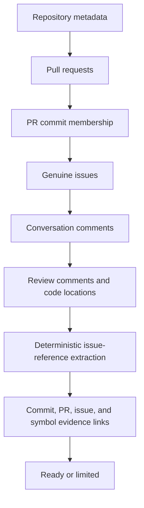

# GitHub development context

Phase 4 adds public, read-only GitHub evidence to an already indexed repository. It records pull
requests, genuine issues, labels, milestones, conversation comments, review comments, PR commit
membership, and the small amount of public identity data needed to display authors. Repository
code and discussion snippets are never executed.

## Public-only access

The backend constructs every GitHub REST path from the owner and repository validated during
Phase 1. The browser cannot supply an arbitrary API URL. There is no OAuth flow, GitHub App,
private-repository access, login, or write operation.

`GITHUB_TOKEN` is optional and server-side only. When set, it increases the public API allowance.
It is placed only in the backend `Authorization` request header and is never stored, logged, or
returned. An empty value uses unauthenticated public requests.

## Sync pipeline

`POST /api/repositories/{id}/github/sync` queues this pipeline through the same local-thread or
Celery abstraction used by other analysis tasks. The endpoint returns immediately. Progress,
counts, safe errors, and rate-limit information are available from
`GET /api/repositories/{id}/github/status`.

Pull requests are sorted by GitHub update time, issues use GitHub's `since` parameter, and changed
entities are upserted. Comments and PR commit membership are reconciled for each changed entity.
Unique constraints prevent duplicate rows when a sync is repeated. Limits are explicit in status
through `github_index_limited`.

## Evidence and confidence

Evidence retains its origin and certainty:

- PR commit membership reported by GitHub is stored as `pr_commit` with high confidence.
- A PR's GitHub merge commit SHA creates a separate `merge_commit` edge.
- `Fixes #12`, `Closes #12`, and `Resolves #12` are strong closing references.
- `See #12`, `Refs #12`, and a bare `#12` are mentions and never promoted to closing claims.
- `owner/repository#12` is retained as external metadata without crawling that repository.

Phase 3 symbol events join their commit to these edges at query time. No PR or issue data is copied
into symbol tables. The normalized `HistoricalEvidence` service shape is available for future
consumers but is not embedded or summarized.

## Rate limits and failures

The client tracks `X-RateLimit-Limit`, `X-RateLimit-Remaining`, and `X-RateLimit-Reset`. Exhaustion
produces `GITHUB_RATE_LIMITED` and a safe retry time. Timeouts, connection failures, and HTTP
502/503/504 responses use bounded exponential retry. Authentication, validation, and missing
resources are not retried indefinitely.

GitHub state is independent from repository state. A sync can be `failed` or `rate_limited` while
Git, Code, History, commits, source, and blame remain fully available.

## Untrusted content

PR bodies, issue bodies, comments, labels, names, diff hunks, and links are external data. The UI
renders body content as escaped React text with a small Markdown subset and never injects HTML.
It does not fetch links found in comments. Body sizes, comment totals, review totals, request
duration, issue totals, and PR totals are bounded by `.env` settings.
